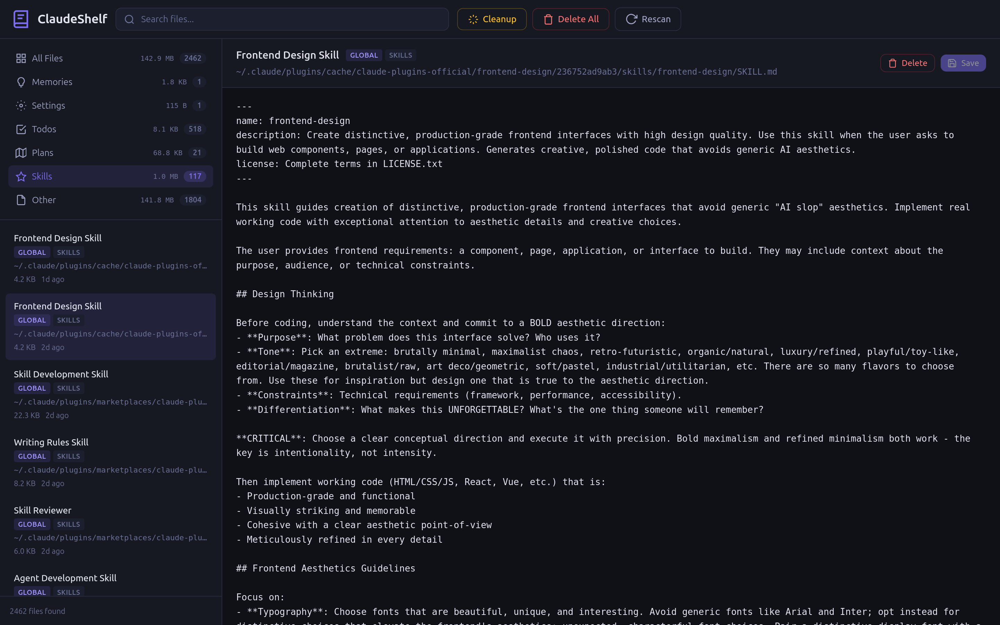

# ClaudeShelf

Browse, search, and edit your Claude Code config files — memories, settings, todos, plans, skills, and project configs — from a local web UI.

Single binary, no dependencies, cross-platform.



## Getting Started

Download a ready-to-run binary from the [latest release](https://github.com/MojtabaTajik/ClaudeShelf/releases/latest), or build from source:

```bash
go build -o claudeshelf . && ./claudeshelf
```

```bash
# Options
./claudeshelf -port 9000              # custom port (default: 8010)
./claudeshelf -path /path/to/dir      # scan a specific directory
```

Open `http://localhost:8010` in your browser.

## What it scans

By default, ClaudeShelf looks in `~/.claude/` and common project directories (`~/projects/`, `~/src/`, `~/dev/`, `~/code/`, `~/workspace/`, `~/repos/`) for Claude-related files like `CLAUDE.md`, `settings.json`, memory files, todos, plans, and skills.

Use `-path` to scan a specific directory instead.

## License

MIT
